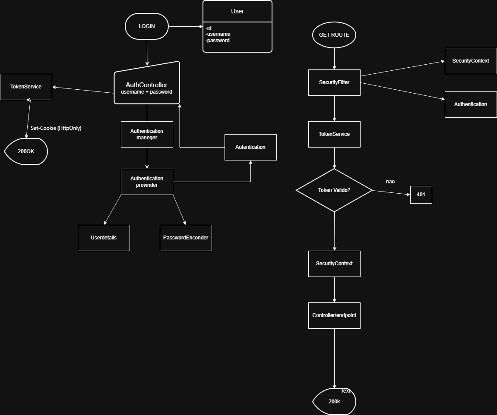
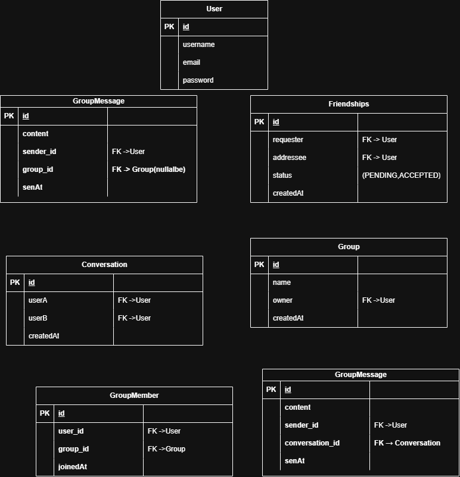

# JavaChat 💬

Aplicação de chat em tempo real desenvolvida com **Java Spring Boot** e **WebSocket/STOMP**, com autenticação via **JWT** armazenado em cookie HttpOnly.

🔗 **Frontend:** [WebChat-Frontend](https://github.com/joao2dev/WebChat-Frontend) — React + Vite

---

## Tecnologias

**Backend:**
- Java 17
- Spring Boot
- Spring Security + JWT (Auth0)
- WebSocket + STOMP
- PostgreSQL
- Hibernate / Spring Data JPA
- Lombok

**Frontend:**
- React + Vite
- @stomp/stompjs
- Axios
- React Router DOM

---

## Arquitetura

O projeto utiliza **arquitetura em camadas (MVC monolítico)**:

```
Controller → Service → Repository → Banco de Dados
```

### Fluxo de Autenticação



### Modelo do Banco de Dados



**Entidades:**
- `User` — usuário da plataforma, implementa `UserDetails`
- `Friendship` — relação de amizade entre dois usuários (status: PENDING, ACCEPTED)
- `Group` — grupo de conversa criado por um usuário
- `GroupMember` — relação N:N entre usuários e grupos
- `Conversation` — conversa direta (DM) entre dois usuários
- `GroupMessage` — mensagens enviadas em grupos
- `DirectMessage` — mensagens enviadas em conversas diretas

---

## Funcionalidades

- ✅ Registro e login com JWT em cookie HttpOnly
- ✅ Envio e aceitação de pedidos de amizade
- ✅ Criação e gerenciamento de grupos
- ✅ Chat em tempo real via WebSocket/STOMP
- ✅ Mensagens diretas (DM) entre usuários
- ✅ Mensagens de grupo com broadcast
- ✅ Autenticação no handshake WebSocket via cookie

---

## Pré-requisitos

- Java 17+
- PostgreSQL
- Node.js (para o frontend)

---

## Como rodar

### Backend

1. Cria o banco de dados:
```sql
CREATE DATABASE chatweb;
```

2. Configura as variáveis de ambiente:
```
DB_USERNAME=postgres
DB_PASSWORD=sua_senha
JWT_SECRET=sua_secret_longa
```

3. Sobe o projeto:
```bash
./mvnw spring-boot:run
```

O backend sobe em `http://localhost:8080`.

### Frontend

1. Clona o repositório do frontend:
```bash
git clone https://github.com/joao2dev/WebChat-Frontend
cd WebChat-Frontend
npm install
npm run dev
```

O frontend sobe em `http://localhost:5173`.

---

## Documentação da API

A documentação completa das rotas REST e WebSocket está em [`API_DOCS.md`](API_DOCS.md).

**Base URL:** `http://localhost:8080`  
**WebSocket:** `ws://localhost:8080/ws`

---

## Estrutura do Projeto

```
src/main/java/com/example/chatweb/
├── Config/
│   ├── SecurityConfig.java
│   ├── SecurityFilter.java
│   ├── TokenService.java
│   ├── UserDetailsServiceImpl.java
│   ├── JWTUserData.java
│   └── CookieHandshakeInterceptor.java (via webscoket/)
├── controller/
│   ├── AuthController.java
│   ├── UserController.java
│   ├── FriendshipController.java
│   ├── GroupController.java
│   ├── GroupMemberController.java
│   ├── ConversationController.java
│   ├── GroupMessageController.java
│   └── DirectMessageController.java
├── Service/
│   ├── UserService.java
│   ├── FriendshipService.java
│   ├── GroupService.java
│   ├── GroupMemberService.java
│   ├── ConversationService.java
│   ├── GroupMessageService.java
│   └── DirectMessageService.java
├── repositories/
├── entity/
├── dto/
└── webscoket/
    ├── WebSocketConfig.java
    ├── ChatController.java
    ├── ChatChannelInterceptor.java
    └── CookieHandshakeInterceptor.java
```

---

## Testes

O projeto utiliza **TDD** com JUnit 5 e Mockito. Os testes cobrem os Services com cenários de sucesso e erro.

```bash
./mvnw test
```

---

## Licença

MIT
